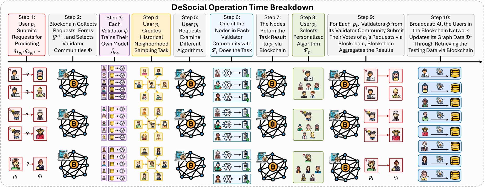

# DeSocial: Blockchain-based Decentralized Social Networks

This repository contains the source code for the DeSocial project. DeSocial is a decentralized social network framework that utilize blockchain infrastructure and graph learning models to enable transparent, user-driven, and personalized social network predictions.

## 🌐 Project Structure

```
DeSocial/
│
├── blockchain/                    # Blockchain simulation environment and client scripts
│    ├── blockchain.py                 # Blockchain infrastructure
│    └── user.py                       # Actions of the users (request, vote, train models, aggregation, etc.)
│
├── contract/                      # Solidity smart contracts for validator voting, user actions, etc.
│    ├── contracts/contract.sol        # The Solidity smart contract.
│    └── other files:                  # The compilation environment.
│
├── data/                          # Processed data. (need to create a direction)
|    └──$DATASET                       # The dataset name
│           ├── edge_list.csv          # The graph edge data.
│           └── node_feat.npy          # The input node features.
│
├── model/                         # Graph learning models, and personalized algorithm selection module (e.g., GraphSAGE, GCN, GAT, etc.)
│    ├── dispatcher.py                 # Model dispatcher, returning an instance of model given its name.
│    ├── models.py                     # Graph algorithm classes.
│    └── select.py                     # The personalized algorithm selection module.
│
├── utils/                         # Utility functions and helpers
│    ├── DataLoader.py                 # Data loader.
│    ├── EarlyStopping.py              # Early stopping of the graph training.
│    ├── configs.py                    # DeSocial config settings.
│    ├── metrics.py                    # Evaluation metric calculation.
│    └── utils.py                      # Misc functions. (negative sampling, initiate validator groups, etc.)
│
├── eval.py                        # Evaluation functions
│
└── run.py                         # Main entry to run the pipeline (including the decentralized multi-validator consensus module.)
```

## 🏗️ Framework

Here gives the framework of DeSocial (both modules enabled).



**Step 1:** User $p_i$ submits requests to predict social links with target nodes $q_{1_{p_i}}, q_{2_{p_i}}, \dots$.
    
**Step 2:** The blockchain collects all user requests, constructs $\mathcal{G}^{t+1}$, and assigns a validator community $\Phi$ according to each backbone model $\mathcal{F}_i\in \mathcal{F}$ through the smart contract.
    
**Step 3:** Each validator selected in this period independently trains their own graph learning model based on the data $\mathcal{D}^t$ stored in their own local memory. $\mathcal{D}^t$ describes the union of the historical snapshots $\mathcal{G}^0, \mathcal{G}^1, ..., \mathcal{G}^t$, and each node stored one copy of $\mathcal{D}^t$.
    
**Step 4:** User $p_i$ creates a personalized neighborhood sampling task based on local graph structure.
    
**Step 5:** Validator nodes retrieve $p_i$'s request  through the blockchain smart contract, and evaluate it using different available algorithms $\mathcal{F}_j$.
    
**Step 6:** One selected validator in each community executes the sampling task using algorithm $\mathcal{F}_j$ and returns results to the blockchain through the smart contract.
    
**Step 7:** The result of each algorithm trial is returned to $p_i$ through the blockchain for evaluation.
    
**Step 8:** User $p_i$ selects a preferred model based on the returned results.
    
**Step 9:** Validators in $\Phi$ run $p_i$'s persoanlized algorithm on $p_i$'s request and submit their binary votes to the blockchain. The blockchain aggregates the votes to form the final prediction. Both the voting and aggregating operations are defined by the smart contract.

**Step 10:** The period ends, all the nodes in the network copy the social network data  $\mathcal{G}^{t+1}$ and merge it to their local memory via the blockchain for the latest links by the smart contract.

For the details of these notations, please refer the problem definitions in our paper.

## ✈️ Quickstart

After downloading the repo to your computer/server, please install all the dependencies by:
```bash
pip install -r requirements.txt
```

For the setup of ETH [Ganache](https://archive.trufflesuite.com/ganache/) environment, please follow `ganache_install.md`.

To create DeSocial smart contract jsons and import them into python, we use [Truffle](https://archive.trufflesuite.com/) to compile the smart contracts written in Solidity programming language. Following the instructions:
```bash
cd contract
truffle compile
```

After the compilation, you will see the smart contract json in `./contract/build/contracts/DeSocial.json`

To run DeSocial, please run
```bash
python run.py
```

To quickly reproduce the result of DeSocial in the best configuration, please run
```bash
python run.py --cuda $CUDA --dataset_name $DATASET --f_pool $F --experts $EXPERTS --metric $METRIC --start_period 28 --load_best_configs
```

The range of some important arguments are specified below:
```
$F in [MLP, GCN, GAT, SAGE, SGC]
$DATASET in [UCI, Memo-Tx, Enron, GDELT]
$METRIC in [Acc@2, Acc@3, Acc@5]
```

For example, if you want to quickly reproduce DeSocial-X (with validator community size of 5), X is one of the backbones, let's say SGC on UCI, please run
```bash
python run.py --cuda 0 --dataset_name UCI --f_pool SGC --experts 5 --start_period 28 --metric Acc@2 --load_best_configs
```

If you want to reproduce DeSocial-PA on UCI, please run
```bash
python run.py --cuda 0 --dataset_name UCI --f_pool PA --start_period 28 --metric Acc@2 --load_best_configs
```

If you want to reproduce DeSocial-Full on UCI, please run
```bash
python run.py --cuda 0 --dataset_name UCI --f_pool PA --experts 5 --start_period 28 --metric Acc@2 --load_best_configs
```

If you want to reproduce DeSocial on UCI at a given backbone selection pool {GraphSAGE, SGC}, please run
```bash
python run.py --cuda 0 --dataset_name UCI --f_pool SAGE+SGC --experts 5 --start_period 28 --metric Acc@2 --load_best_configs
```
use "+" to combine the backbone names.

Different from centralized algorithms, in each period the blockchain selects different validators. As there are tens of thousands of nodes, it's likely to train every validator given random ML parameters. Therefore, we can reproduce the result from the first testing period. As t+2=30 (the first testing period), the start period is set to 28.

We reported the run time based on observing one evaluation metric because the overload of voting and aggregation is high in serial, not parallel.