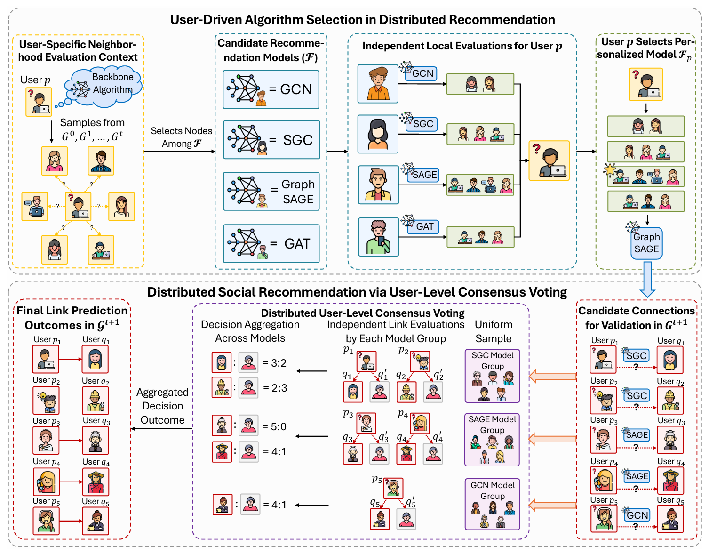

# DeSocial: User-Validated Distributed Social Recommendation

This repository contains the source code for the DeSocial project. DeSocial is a distributed social recommendation framework that enables transparent, user-driven, and personalized social network predictions through graph learning models and multi-validator consensus. 

## 📒 Citation

If you find this work useful, please cite our paper:

```bibtex
@inproceedings{desocial2025,
  title={From Aggregation to Selection: User-Validated Distributed Social Recommendation},
  author={Huang, Jingyuan and Luo, Dan and Ye, Zihe and Chen, Weixin and Guo, Minghao and Zhang, Yongfeng},
  booktitle={Companion Proceedings of the ACM Web Conference},
  year={2025}
}
```

## 🌐 Project Structure

```
DeSocial/
│
├── data/                          # Processed data.
|    └──$DATASET                       # The dataset name
│           ├── edge_list.csv          # The graph edge data.
│           └── node_feat.npy          # The input node features.
│
├── model/                         # Graph learning models, and personalized algorithm selection module (e.g., GraphSAGE, GCN, GAT, etc.)
│    ├── dispatcher.py                 # Model dispatcher, returning an instance of model given its name.
│    ├── models.py                     # Graph algorithm classes.
│    └── select.py                     # The personalized algorithm selection module.
│
├── system/                        # Distributed coordination system
│    ├── coordinator.py                # Central coordinator for validator selection and consensus aggregation.
│    └── user.py                       # User class for the distributed social recommendation system.
│
├── utils/                         # Utility functions and helpers
│    ├── dataloader.py                 # Data loader.
│    ├── earlystopping.py              # Early stopping of the graph training.
│    ├── configs.py                    # DeSocial config settings.
│    ├── metrics.py                    # Evaluation metric calculation.
│    └── utils.py                      # Misc functions. (negative sampling, initiate validator groups, etc.)
│
├── eval.py                        # Evaluation functions.
│
├── run.py                         # Main entry to run the pipeline (including the distributed multi-validator consensus module).
│
└── requirements.txt               # DeSocial execution environment dependencies.
```

## 🏗️ Framework

Here gives the framework of DeSocial (both modules enabled).



## 📊 Datasets

For the dataset we use, we provide the url for the `edge_list.csv` file.

- [UCI](https://zenodo.org/records/7213796#.Y1cO6y8r30o) (uci.zip, ml_uci.csv) [Towards Better Evaluation for Dynamic Link Prediction, NeurIPS 2022]
- Memo-Tx is processed by ourselves. Please refer to data/Memo-Tx.
- [Enron](https://drive.google.com/drive/folders/1QFxHIjusLOFma30gF59_hcB19Ix3QZtk) (edge_list.csv) [DTGB, NeurIPS 2024]
- [GDELT](https://drive.google.com/drive/folders/1QFxHIjusLOFma30gF59_hcB19Ix3QZtk) (edge_list.csv) [DTGB, NeurIPS 2024]

The node features is generated by `np.random`, and we recommend to use our provided `.npy` files.
We attach the datasets we use in DeSocial [here](https://drive.google.com/drive/folders/1CkLzngmQunu2JUfQWiKSHQ-yM89KAQTP?usp=sharing) for all datasets.

The graph training algorithms are implemented based on the open-source [DTGB](https://github.com/zjs123/DTGB) benchmark.

## ✈️ Quickstart

### Environment Setup

After downloading the repository, please install all the dependencies by
```bash
python -m venv DeSocial
source DeSocial/bin/activate
pip install -r requirements.txt
```

If you want to deactivate the environment, simply run
```bash
deactivate
```

### Running DeSocial

To run DeSocial, please run
```bash
python run.py
```

To quickly reproduce the result of DeSocial in the best configuration, please run
```bash
python run.py --cuda $CUDA --dataset_name $DATASET --f_pool $F --experts $EXPERTS --metric $METRIC --start_period 28 --load_best_configs
```

The range of some important arguments are specified below:
```
$F in [MLP, GCN, GAT, SAGE, SGC, PA] (PA for enabling personalized algorithm selection.)
$DATASET in [UCI, Memo-Tx, Enron, GDELT]
$METRIC in [Acc@2, Acc@3, Acc@5]
```

For example, if you want to quickly reproduce DeSocial-X (with validator community size of 5), X is one of the backbones, let's say SGC on UCI, please run
```bash
python run.py --cuda 0 --dataset_name UCI --f_pool SGC --experts 5 --start_period 28 --metric Acc@2 --load_best_configs
```

If you want to reproduce DeSocial-PA on UCI, please run
```bash
python run.py --cuda 0 --dataset_name UCI --f_pool PA --experts 1 --start_period 28 --metric Acc@2 --load_best_configs
```

If you want to reproduce DeSocial-Full on UCI, please run
```bash
python run.py --cuda 0 --dataset_name UCI --f_pool PA --experts 5 --start_period 28 --metric Acc@2 --load_best_configs
```

If you want to reproduce DeSocial on UCI at a given backbone selection pool {GraphSAGE, SGC}, please run
```bash
python run.py --cuda 0 --dataset_name UCI --f_pool SAGE+SGC --experts 5 --start_period 28 --metric Acc@2 --load_best_configs
```
use "+" to combine the backbone names.

If you want to disable the distributed multi-validator consensus, please run
```bash
python run.py --cuda 0 --dataset_name UCI --f_pool PA --experts 1 --start_period 28 --metric Acc@2 --load_best_configs
```

If you just want to try a single backbone, please run
```bash
python run.py --cuda 0 --dataset_name UCI --f_pool SGC --experts 1 --start_period 28 --metric Acc@2 --load_best_configs
```

In distributed social recommendation, each period the system selects different validators. As there are tens of thousands of nodes, it's likely to train every validator given random ML parameters. Therefore, we can reproduce the result from the first testing period. As t+2=30 (the first testing period), the start period is set to 28.

We reported the run time based on observing one evaluation metric because the overload of voting and aggregation is high in serial, not parallel.


